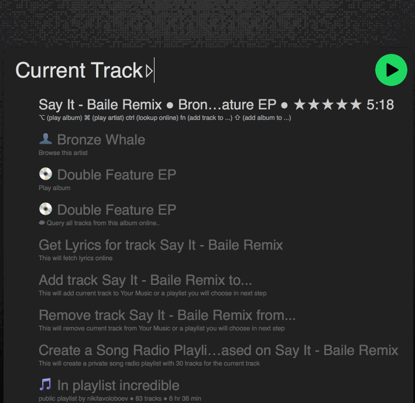
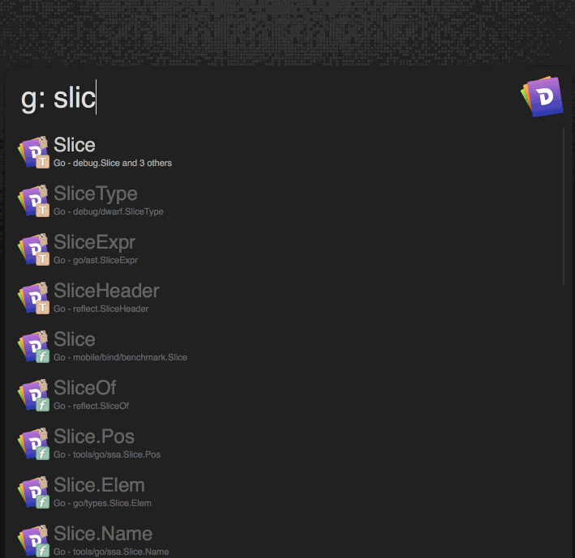
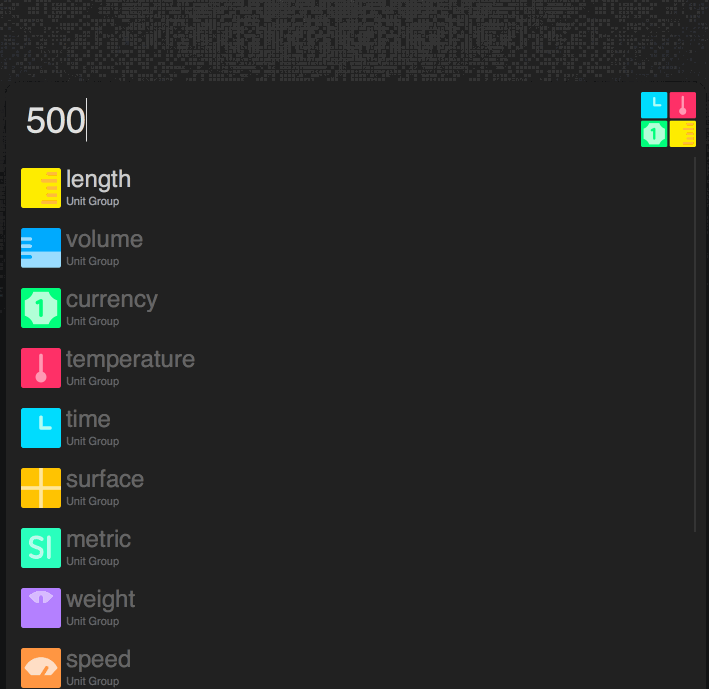
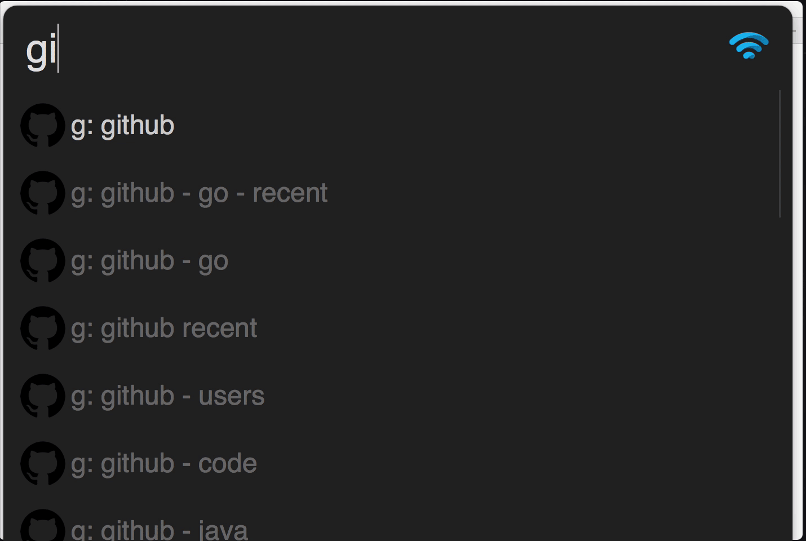

<h1 align="center"> Free Alfred Workflows all can use 🎩 </h1>

	

<h1 align="center"> Description 📕</h1>

This is an extension to [Learn Anything Search Engine](https://learn-anything.xyz/) that lists all the interesting [alfred workflows](https://www.alfredapp.com/workflows/) one can use to learn new things and discover new insights faster. 🔭

Pull requests are welcome. Thank you. 💙

#### Related websites / repositories 

- [awesome workflows](https://github.com/derimagia/awesome-alfred-workflows)
- [alfred workflows](https://github.com/zenorocha/alfred-workflows)
- [alfred workflows for developers](https://github.com/willfarrell/alfred-workflows)
- [alfred workflows by Vitor](https://github.com/vitorgalvao/alfred-workflows)

<h1 align="center"> Essential Workflows</h1>

<h2 align="center"><a href="https://github.com/deanishe/alfred-searchio"> Searchio </a></h2>

- quickly search Google, Youtube, Wikipedia, Amazon, Google Images and Maps quickly and with autosuggestions being provided with every query you type. 

<h2 align="center"><a href="https://github.com/vdesabou/alfred-spotify-mini-player"> Spotify Mini Player </a></h2>

- fully control Spotify from Alfred

<h2 align="center"><a href="https://github.com/Kapeli/Dash-Alfred-Workflow"> Dash </a></h2>

- very quickly search through any docset that you have downloaded
- you can also scope your search to any specific docset that you want to search for and even create a supplementary workflow to search for specific docsets from hotkeys you set (like for example [here](https://www.dropbox.com/s/ajcimkk47ikwimv/dash.alfredworkflow?dl=1))

<h2 align="center"><a href="https://github.com/lox/alfred-github-jump"> GitHub Jump </a></h2>

- saves all your starred repositories to a local database and then allows to fuzzy search on the contents of it. Incredibly fast.

<h2 align="center"><a href="https://git.deanishe.net/deanishe/alfred-safari-assistant"> Safari Assistant </a></h2>

- search through your Safari history, bookmarks, reading list and more

<h2 align="center"><a href="http://units.dnsu.ch"> Units </a></h2>

- do quick unit conversions 

<h2 align="center"><a href="https://github.com/zhaocai/alfred2-keylue-workflow"> Key Clue </a></h2>

- search through currently active app's menu bar quickly from Alfred

<h2 align="center"><a href="https://github.com/nikitavoloboev/alfred-web-searches"> Web Searches </a></h2>

- search through any website on the web from Alfred
- the list of websites can be found [here](https://github.com/nikitavoloboev/alfred-web-searches/blob/master/workflow/websites.csv) and can be easily extended

<h2 align="center"><a href="https://github.com/vitorgalvao/alfred-workflows/tree/master/ProcessControl"> Process Control </a></h2>

- search through currently active processes and kill ones that are misbehaving quickly

<h2 align="center"><a href="https://github.com/deanishe/alfred-mailto"> Mailto </a></h2>

- search through your contact list to send emails to one or multiple people

<h2 align="center"><a href="https://github.com/bevesce/unicode-symbols-search"> Symbols Search </a></h2> 

- quickly search through all the unicode symbols

<h2 align="center"><a href="https://github.com/ddjfreedom/recent-downloads-alfred-v2"> Recent Downloads </a></h2>

- browse through your Downloads directory or any other directory you specify from Alfred 

<h2 align="center"><a href="https://www.alfredforum.com/topic/275-eggtimer-v2-updated-to-20-final/"> Eggtimer </a></h2>

- quickly set timers to notify you of things 

<h2 align="center"><a href="https://github.com/nikitavoloboev/alfred-ask-create-share"> Ask Create Share </a></h2>

- create many of web's submission from Alfred

<h2 align="center"><a href="https://github.com/deanishe/alfred-ssh"> Secure Shell </a></h2>

- open SSH/SFTP/mosh connections from Alfred

<h2 align="center"><a href="https://github.com/isometry/alfred-tty"> Alfred tty</a></h2>

- quickly switch between or close iTerm windows, tabs and panes based on title and tty

<h2 align="center"><a href="https://www.alfredforum.com/topic/5233-uploadfile-—-upload-files-and-directories-for-easy-sharing/"> Upload Files </a></h2>

- quickly upload local files to share with [transfer.sh](transfer.sh)

<h2 align="center"><a href="https://www.alfredforum.com/topic/2045-downvid-%E2%80%94-download-videos-from-popular-sources/">DownVid </a></h2>

- download videos from a [plethora of video sources](https://rg3.github.io/youtube-dl/supportedsites.html), even when embedded to other pages

<h2 align="center"><a href="https://github.com/jvandyke/alfred-hastebin">Hastebin </a></h2>

- create [Hastebin](https://hastebin.com) snippet from selected text

<h2 align="center"><a href="https://github.com/nikitavoloboev/alfred-my-mind">Alfred My Mind </a></h2>

- search through bookmarks, notes and various websites quickly from Alfred

<h1 align="center"> Productivity Workflows</h1>

<h2 align="center"> <a href="https://github.com/fniephaus/alfred-pocket">Pocket</a> </h2>

- search through your [Pocket](https://getpocket.com) reading list

<h2 align="center"> <a href="https://github.com/jason0x43/alfred-toggl">Toggl</a> </h2>

- operate Toggl from Alfred

<h2 align="center"> <a href="https://www.alfredforum.com/topic/8385-webscreenshot-—-take-screenshots-directly-to-the-web/">Web Screenshot</a> </h2>

- take a screenshot, it uploads it to Imgur and gives you a link instantly

<h2 align="center"> <a href="https://github.com/iansinnott/alfred-maestro">Alfred Maestro</a></h2>

- search through your [Keyboard Maestro](https://www.keyboardmaestro.com/main/) macros from Alfred

<h2 align="center"> <a href="https://github.com/jason0x43/alfred-weather">Weather</a></h2>

- get latest weather for the day, week 

<h2 align="center"> <a href="https://github.com/nikitavoloboev/alfred-karabiner"> Reload Karabiner </a> </h2>

- reload [Karabiner](https://github.com/tekezo/Karabiner) config quickly

<h2 align="center"> <a href="http://www.packal.org/workflow/machineclean"> Machine Clean </a> </h2>

- freeze keyboard input for some time to clean your keyboard

<h2 align="center"> <a href="http://www.packal.org/workflow/uninstall-cleanmymac-3"> Uninstall with Clean my Mac 3 </a> </h2>

- uninstall applications quickly using [Clean my Mac](https://macpaw.com/cleanmymac)

<h2 align="center"> <a href="https://github.com/surrealroad/alfred-notes"> Notes </a> </h2>

- make new notes or search notes from macOS notes app quickly

<h1 align="center"> Writing Workflows</h1>

<h2 align="center"> <a href="https://github.com/robwalton/alfred-ulysses-workflow"> Ulysses </a> </h2>

- search for sheets or groups from [Ulysses](https://ulyssesapp.com/)

<h1 align="center"> macOS Workflows </h1>

<h2 align="center"> <a href="https://github.com/sindresorhus/alfred-dark-mode"> Dark Mode </a> </h2>

- quickly toggle menu bar dark mode 

<h1 align="center"> Programming Workflows </h1>

<h2 align="center"> <a href="https://github.com/sindresorhus/alfred-npms"> Npms </a> </h2>

- search for npm packages with [npms.io](https://npms.io)

<h2 align="center"> <a href="https://github.com/BenchR267/Pod-Search-Alfred"> Pod Search </a> </h2>

- search through [Cocoapods](https://cocoapods.org) with Alfred

<h2 align="center"> <a href="https://www.renfei.org/snippets-lab/manual/mac/tips-and-tricks/alfred-integration.html"> SnippetsLab </a> </h2>

- Alfred integration for [SnippetsLab](https://www.renfei.org/snippets-lab/) app

<h2 align="center"><a href="https://github.com/danielecook/gist-alfred"> GitHub Gists </a></h2>

- search through GitHub gists from Alfred

<h2 align="center"><a href="https://www.alfredforum.com/topic/1071-unix-man-page-workflow/"> New Terminal Window </a></h2>

- open man pages with name and section filtering

<h2 align="center"><a href="https://github.com/miromannino/alfred-new-terminal-window"> New Terminal Window </a></h2>

- open a new Terminal/iTerm window in the current macOS space

<h1 align="center">Web Workflows</h1>

<h2 align="center"><a href="https://github.com/deanishe/alfred-reddit"> Reddit </a></h2>

- find subreddits and browse hot posts from [Reddit](http://reddit.com)

<h1 align="center"> Design Workflows</h1>

<h2 align="center"><a href="https://github.com/mi-ca/alfredapp_flatuicolors_workflow"> Flat UI Colours </a></h2>

- get flat colour hexa codes from [flatuicolors.com](flatuicolors.com)

<h1 align="center"> Utilities Workflows</h1>

<h2 align="center"><a href="https://github.com/deanishe/alfred-pwgen"> Alfred Pwgen </a></h2>

- generate secure passwords from Alfred

<h2 align="center"><a href="https://github.com/deanishe/alfred-similar-image-search"> Google Similar Images </a></h2>

- Google image searches based on local files

<h1 align="center"> Social Workflows</h1>

<h2 align="center"><a href="https://github.com/Jamesits/alfred-workflow-telegram">Telegram </a></h2>

- search for stickers and quickly operate Telegram from Alfred

<h1 align="center"> Translation Workflows</h1>

<h2 align="center"><a href="https://github.com/podgorniy/alfred-translate"> Translate ru-en en-ru </a></h2>

- quickly translate from russion > english and vice versa

<h1 align="center">  Alfred Help Workflows</h1>

<h2 align="center"><a href="https://github.com/jmjeong/alfred-extension"> Manage Alfred </a></h2>

- quckly open any Alfred Workflow directory in your terminal

